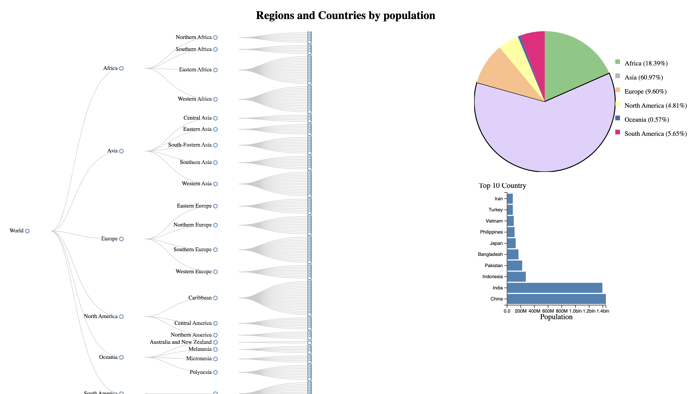

Introduction:
In this report, I present an interactive visualization interface designed for analyzing population data. The interface utilizes various visual encodings, interaction techniques, and animation effects to facilitate data exploration and understanding. The application is implemented using JavaScript with a focus on leveraging the D3 library for visualization tasks. You can try it on this website: https://allamm1.studio/popVis/vis.html

Data Description:
The population data used in this application is sourced from https://data.worldbank.org/indicator/SP.POP.TOTL . The dataset includes demographic information such as population counts, geographical regions, continents, and country-level data. Prior to visualization, I applied a preprocessing pipeline to clean and transform the data for effective analysis.

Features of the Application:

Tree Map: The treemap visualization provides an overview of population distribution across continents, regions, and countries. Each hierarchical level is represented by nested rectangles, with size encoding population count.
Pie Chart: The pie chart illustrates the relative population proportions of different continents. Each slice represents a continent, and the size of the slice corresponds to the population percentage.
Bar Chart: When a user clicks on a continent slice in the pie chart, a bar chart will appear below, displaying the top 10 countries by population within that continent.

Interactions: Users can interact with the visualizations by clicking on specific elements to reveal additional information. For example, hovering on a country node in the treemap displays the country name and population details. When user select a continent in the pie chart, bar chart with relevant data (top 10 countries) to the selected continent (slice of a pie chart) will appear.
The interface dynamically updates the visualizations when interacting with the data, providing real-time feedback and enabling users to explore different aspects of the population data.

Visual Encodings: I chose the treemap and pie chart visualizations to effectively represent hierarchical and proportional data, respectively. The size encoding in the treemap conveys population magnitude, while color and labels aid in differentiation and comprehension. The pie chart utilizes angle and color encodings to represent continent proportions.
Interaction Techniques: I implemented click-based interactions to allow users to drill down into specific regions and countries, revealing population details. This enables users to focus on specific areas of interest and uncover insights. The dynamic updates enhance the responsiveness and interactivity of the interface.
Animation Techniques: I employed smooth transitions and animations to improve the user experience and provide visual cues during updates and transitions between views. For example, when clicking on a country in the treemap, the selected node expands smoothly to reveal the population information (not working properly, error with node click event).

Usage Scenarios:
Comparative Analysis: Users can compare population sizes across continents, regions, and countries, identifying trends and variations.
Regional Exploration: Users can drill down into specific regions to analyze population distribution and observe variations within regions.
Country-Specific Analysis: Users can investigate population demographics, growth rates, and compare countries within the same region or across different regions.
Continent Analysis: Users can click on a continent in the pie chart to view a bar chart showing the top 10 countries by population within that continent, facilitating further exploration and comparison.

Observations:

Population Distribution: The treemap visualization allows users to observe the distribution of the world population across continents, regions, and countries, providing insights into population density and disparities.
Continent Comparison: The pie chart enables users to compare the relative population sizes of different continents, highlighting demographic patterns and disparities.
Regional Variations: By exploring regions and countries, users can identify variations in population density, growth rates, and other demographic factors.
Top Countries by Continent: The bar chart, triggered by clicking on a continent in the pie chart, displays the top 10 countries by population within that continent. This allows users to gain insights into the population distribution within continents and identify the most populous countries.

Running the code:
To run the code the server could be run simply by : “python -m http.server 8000”
And website http://localhost:8000/ will show the charts and user can interact with it.
I also made showcase demo website you can access it here - https://allamm1.studio/popVis/vis.html

Conclusion:

      In conclusion, the interactive visualization interface presented in this report offers a powerful tool for analyzing population data. By leveraging visual encodings, interaction techniques, and animation effects, I have created a platform that allows users to gain insights into population patterns, regional variations, and demographic trends. The interface provides an intuitive and engaging user experience, facilitating effective exploration and understanding of population data
