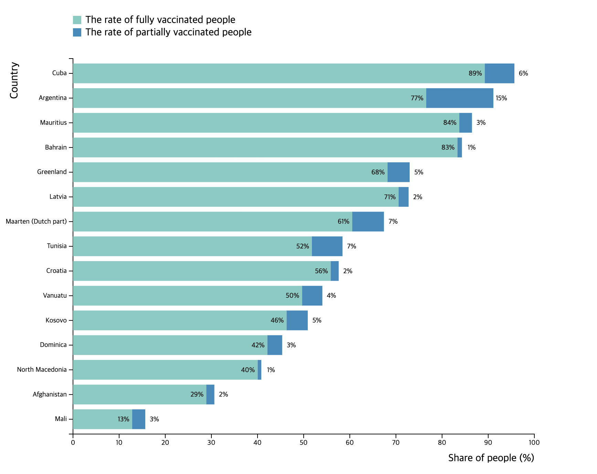

# Exercise2

## Description
In this exercise, you will create a stacked bar chart of vaccination rates by country. We will provide you international COVID-19 dataset from Our World in Data. The CSV file follows a format of 1 row per location and date. The variables represent all of the data related to confirmed cases, deaths, hospitalizations, testing, and other variables of potential interest. Focusing on the specific variables below, please generate the chart that satisfies the requirements.

### Data processing

Before drawing the graph with D3.js, get usable information from raw data. You should generate a horizontal stacked bar chart of two categories—the rate of fully vaccinated people (left) and the rate of partially vaccinated (right) per country. To compute these percentages, you can use the variables described below.

|Name of the variable|Description|
| ------ | ------ |
|people_vaccinated| Total number of people who received at least one vaccine dose|
|people_fully_vaccinated|Total number of people who received all doses prescribed by the initial vaccination protocol|
|population|The population of a country|

You can get the number of partially vaccinated people by computing 
`people_vaccinated - people_fully_vaccinated`
since the people who are classified as partially vaccinated only received a single-dose vaccine. Divide the population to get the percentage. 

Please generate the chart of the top 15 countries based on the share of people vaccinated. When you process the data, consider the few things below.

1. Use the most recent values of each country (If the most recent dates of values in countries A and B are different, it’s okay) 
2. Exclude the countries where the total vaccination rate is over 100%
3. Sort by the rate of vaccinated people (partially + fully) in descending order from top to bottom 

### Presentation

To present the data, please follow the direction below.
1. Set the x-axis range from 0 to 100 percent with evenly spaced ticks
2. Display the top 15 countries on the y-axis
3. Draw a horizontal stacked bar of the rate of fully vaccinated people (left) and the bar represents the rate of partially vaccinated people (right).
4. Color the left bar ‘#7bccc4’ and color the right bar '#2b8cbe’ 
5. Label the percentage of each bar. Mark the number inside the bar if it is right and outside if it is left bar.

### Example visualization
The final visualization will look similar to the chart below. The selected countries are just examples and should be different from this.

